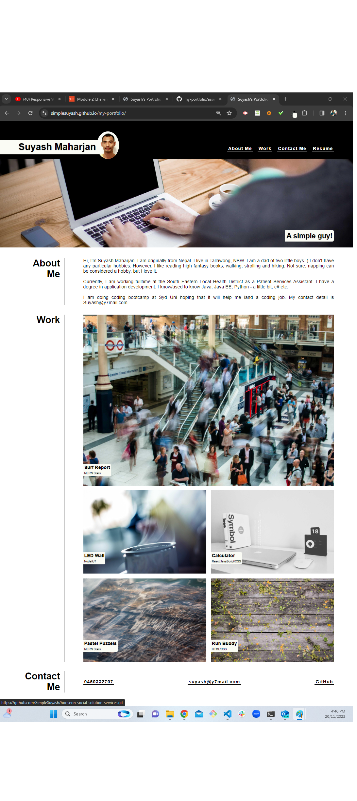
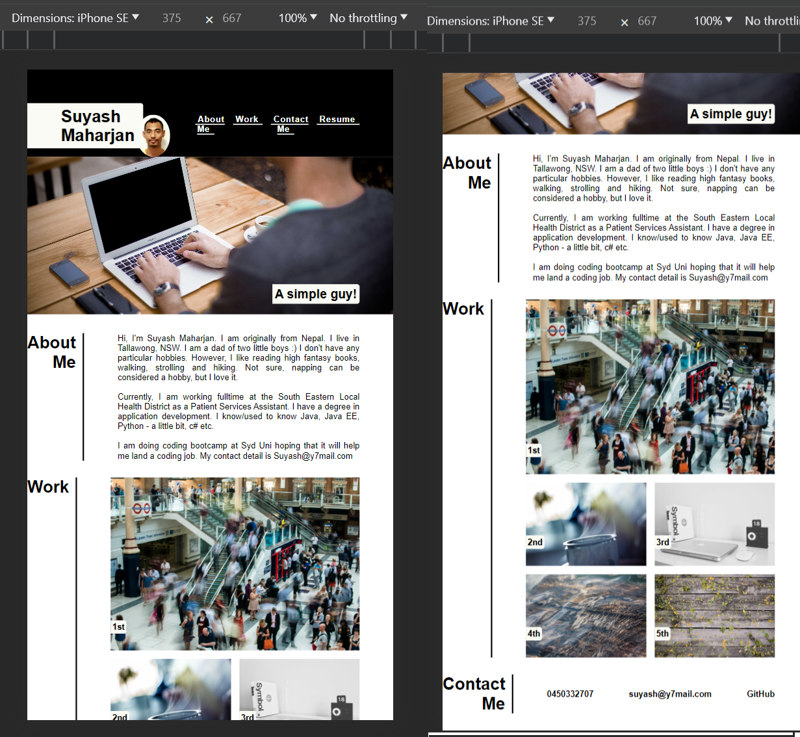

# my-portfolio

My portfolio webpage contains information about myself, links to my deployed web applications, my contact details and resume.

## Description

As a potential employee, my portfolio webpage's main aim is to show the employers the list of my work sample i.e., deployed webpages so that they can review samples of my work and help them assess suitablility of my candidacy for an open position.

Not only the webpage has list of my deployed webpages, it also has a section about my introduction, my name and my photo icon, and my contact details such as telephone number, email, GitHub link.

The placeholder images are used from: <a href="https://picsum.photos/"> Picsum Photos</a>

### Acceptance Criteria

    GIVEN I need to sample a potential employee's previous work
    WHEN I load their portfolio
    THEN I am presented with the developer's name, a recent photo or avatar, and links to sections about them, their work, and how to contact them
    WHEN I click one of the links in the navigation
    THEN the UI scrolls to the corresponding section
    WHEN I click on the link to the section about their work
    THEN the UI scrolls to a section with titled images of the developer's applications
    WHEN I am presented with the developer's first application
    THEN that application's image should be larger in size than the others
    WHEN I click on the images of the applications
    THEN I am taken to that deployed application
    WHEN I resize the page or view the site on various screens and devices
    THEN I am presented with a responsive layout that adapts to my viewport
  

My portfolio contains the sample of my previous work. Also, on the top are my full name in big and bold letter, my profile photo icon, and navigation links that connect to the corresponding sections of the page. It also has a big hero image with my slogan  on it. When the employers click on the images that shows my previous work, then they will be taken to appropriate gitHub pages. For easy identification, my first deployed webpage has been featured on the page with bigger picture. The webpage is fluid and responsive. It can be view on various screens and devices and the webpage layout will adapt to user's viewport accordingly.

## Screenshot

## Link to Deployed Application

<ul>https://github.com/SimpleSuyash/my-portfolio.git</ul>
<ul>https://simplesuyash.github.io/my-portfolio/</ul>

